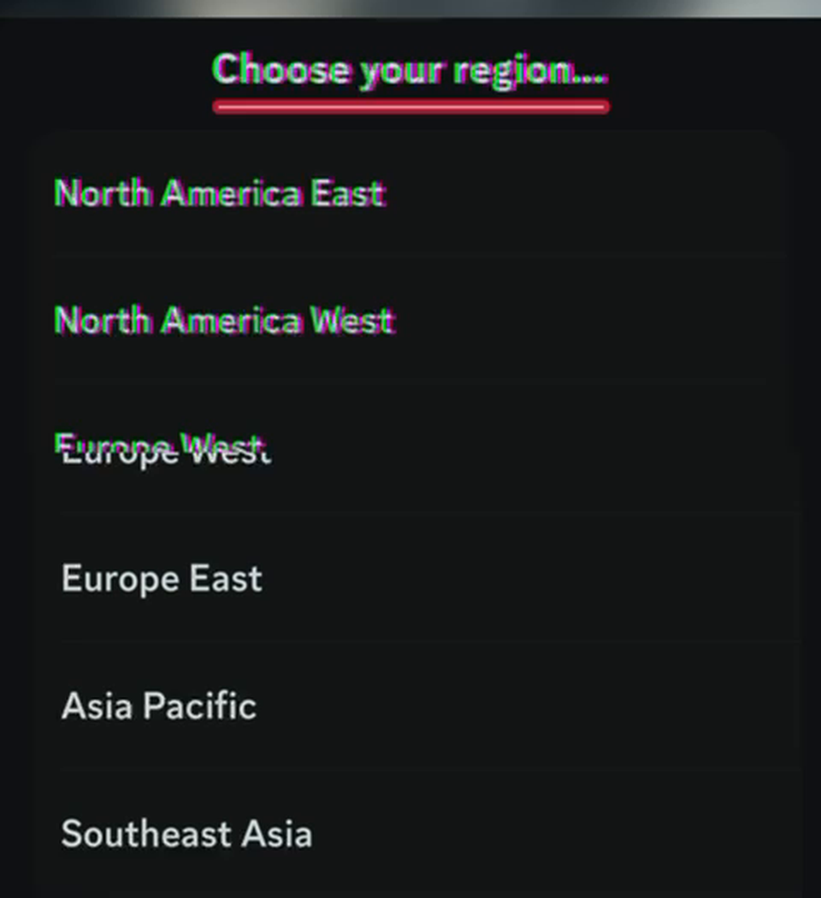
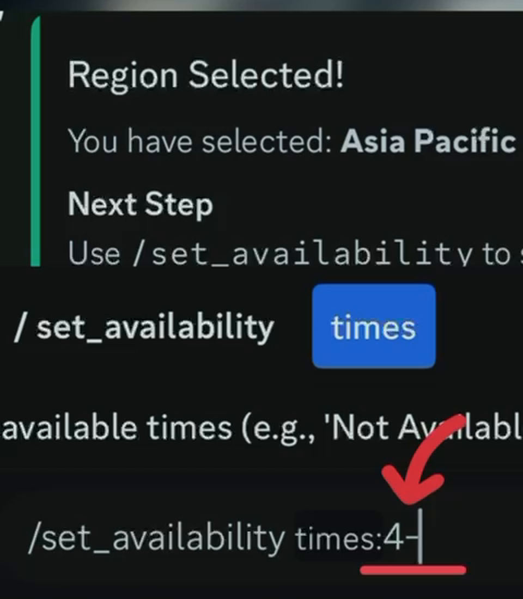
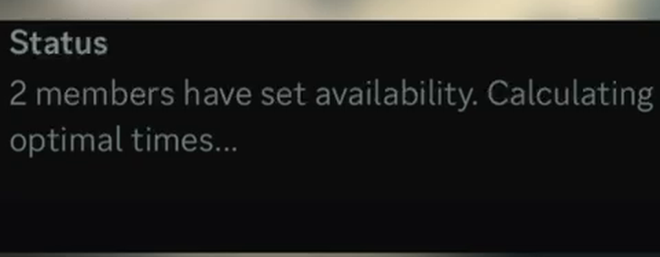
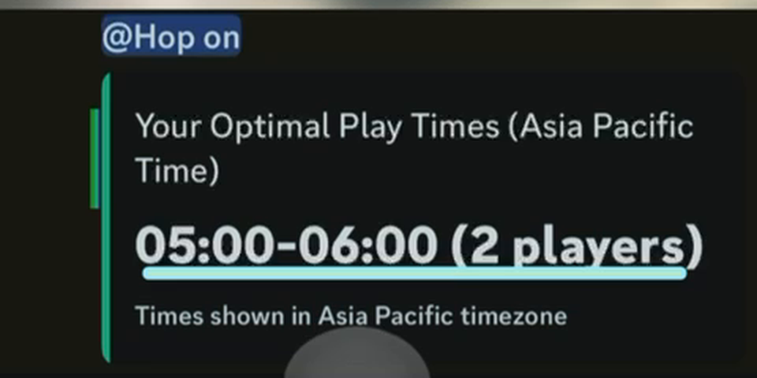

# Bot Drop — Availability Bot

A Discord bot that solves a simple, annoying problem: everyone in a friend group is free at *different* times, so even though there's usually some overlap, nobody finds it and people end up not playing together. This bot collects everyone's free hours (in their own timezone), does the math, and tells the group when the most people are actually free.

I built this the summer before 10th grade, taught myself how to package and sell it, and listed it on [Whop](https://whop.com/botdrop) with demo videos on [YouTube](https://www.youtube.com/@Bot-Drop/shorts).

It didn't sell. I've since worked out why — the mistakes were mine and they were fixable — and I'm in the middle of fixing them. This repo is the code plus the honest record of that: what I built, how I tried to sell it, where I went wrong, and what I'm changing.

## What it does

- `/choose_region` — pick your region from a dropdown (this is how the bot knows your timezone)
- `/set_availability` — tell the bot when you're free, in plain formats like `14-16` or `9-12, 18-20`
- `/show_schedule` — see the server's schedule and the slot where the most people overlap
- `/clear_my_data` — wipe your own data
- `/help` — in-Discord help for all of the above

Once two or more people set their availability, the bot works out the best overlapping window automatically and posts it to each person **in their own local time**, not one shared timezone.

## What it looks like

| Pick your region | Set your free hours |
|---|---|
|  |  |

Once two people have set their times, the bot works out the overlap:





*(Frames from the demo video — full clips and branding assets are in [docs/media](docs/media).)*

## Where this stands right now

The bot works. Distribution was the problem, not the code.

The single biggest cause turned out to be embarrassing: **every product on my store was set to Hidden.** Nobody who clicked through from my videos could see anything to get. That's now fixed, along with cutting four confusing overlapping products down to one free one.

What's still true is that using the bot means downloading the source and running it yourself, which is a big ask for a server owner who isn't a developer. Getting it hosted so it's one click to add is the next job.

Full breakdown in [docs/WHAT_WENT_WRONG.md](docs/WHAT_WENT_WRONG.md); what's next in [docs/ROADMAP.md](docs/ROADMAP.md).

## Docs

- [docs/STORY.md](docs/STORY.md) — why I built it and how the business attempt went
- [docs/WHAT_WENT_WRONG.md](docs/WHAT_WENT_WRONG.md) — the specific mistakes, and what I learned from each
- [docs/ROADMAP.md](docs/ROADMAP.md) — what I'm changing next

## Running the bot yourself

See [bot/README.md](bot/README.md).

## Project layout

```
bot/            the Discord bot source code (Python)
docs/           the story, the mistakes, and the roadmap
website/        a future "Add to Discord" landing page (not built yet)
```

## Links

- Whop listing: https://whop.com/botdrop
- Demo videos: https://www.youtube.com/@Bot-Drop/shorts
